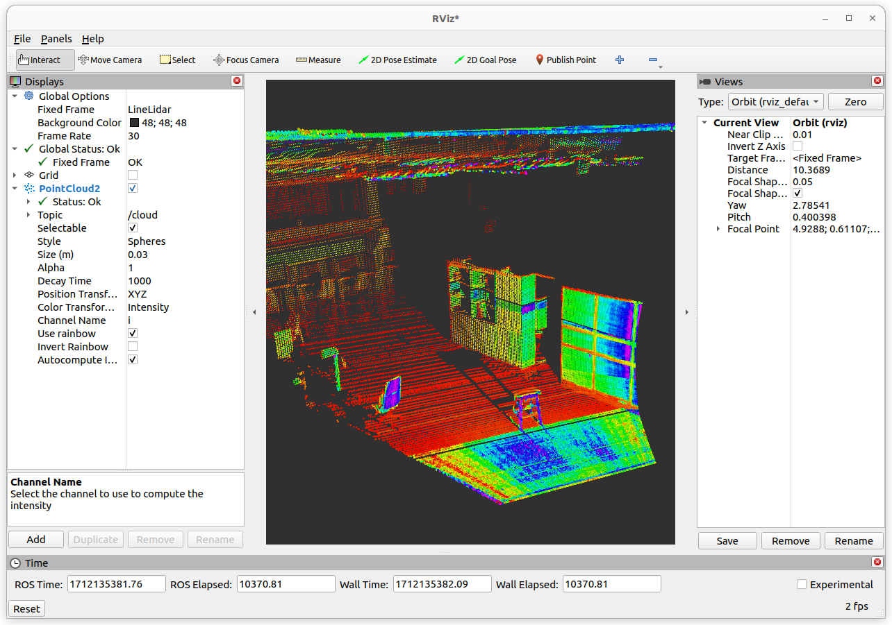

# Noptel-LineLIDAR-ROS2
- ROS2 gateway for Noptel LineLIDAR
- Tested to work on ROS2 Humble
- Publishes pointclouds from the lidar to /cloud topic of type PointCLoud2

## Install
Clone into a Ros2 workspace:

```
mkdir -p ~/ros2_ws/src
cd ~/ros2_ws/src
git clone https://github.com/TAUMRG/Noptel-LineLIDAR-ROS2.git
cd ..
```
Change launch file parameters:

https://github.com/TAUMRG/Noptel-LineLIDAR-ROS2/blob/dfde9d6338313fafee00204c6aabfbcca219fd5f/launch/ll.launch.py#L15-L19


Build with colcon and source:
```
colcon build --symlink-install
source install/setup.bash
```
If you get setuptools deprication warning, downgrade it to version 58. (See Issues bellow for more info)

## Usage

Launch the LineLidar node:
```
ros2 launch Noptel_LineLIDAR_ROS2 ll.launch.py
```

Transformation can be changed with tf:
```
ros2 run tf2_ros static_transform_publisher 0 0 0 0 0 0 world LineLidar
```

Pointcloud can be visualised with Rviz:
```
rviz2
```


## ToDo

* Services for changing lidar settings
* Diagnostics topic

## Issues

* The way ROS2 uses Setuptools is being depricated, no updates yet, this causes error in build process. Workaround is to downgrade setuptools to version 58 or suppress warnings with environment variable:
  
```
python3 -m pip install setuptools==58.2.0
```
```
PYTHONWARNINGS="ignore:setup.py install is deprecated::setuptools.command.install"; export PYTHONWARNINGS
```
