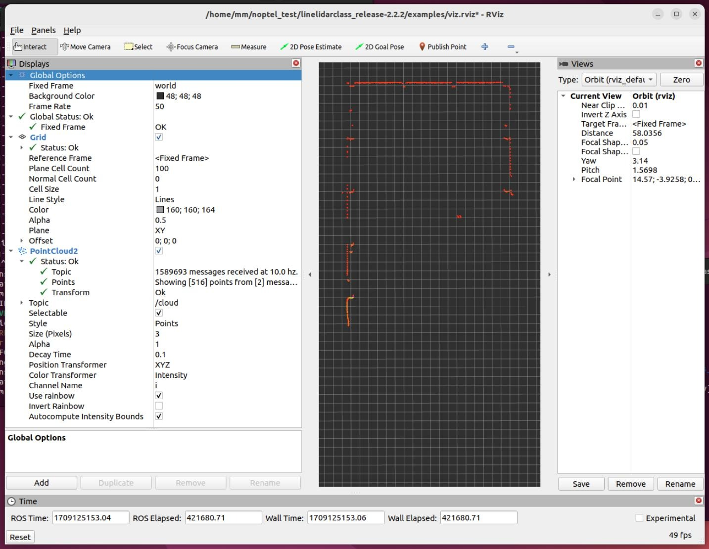

# Noptel-LineLIDAR-ROS2
ROS2 gateway for Noptel LineLIDAR

Publishes pointclouds from the lidar to /cloud topic of type PointCLoud2
## Usage
First change lidar's IP address on the script:
https://github.com/TAUMRG/Noptel-LineLIDAR-ROS2/blob/ed873cc7f2184dfe654da8025532eb1de0a3c7e4/ros2/ll_ros2.py#L160
Then run the following in terminal:
```
cd ros2
python3 ll_ros2.py
```

Transformation can be changed with tf:
```
ros2 run tf2_ros static_transform_publisher 0 0 0 0 0 0 world LineLidar
```

Pointcloud can be visualised with Rviz:
```
rviz2
```


## ToDo

* Create a ros2 package
* Launch file with parameters
* Services for changing lidar settings
* Diagnostics topic

## Issues

* IndexError in cloud_out() function. Does not crash the node, ignored for now.
